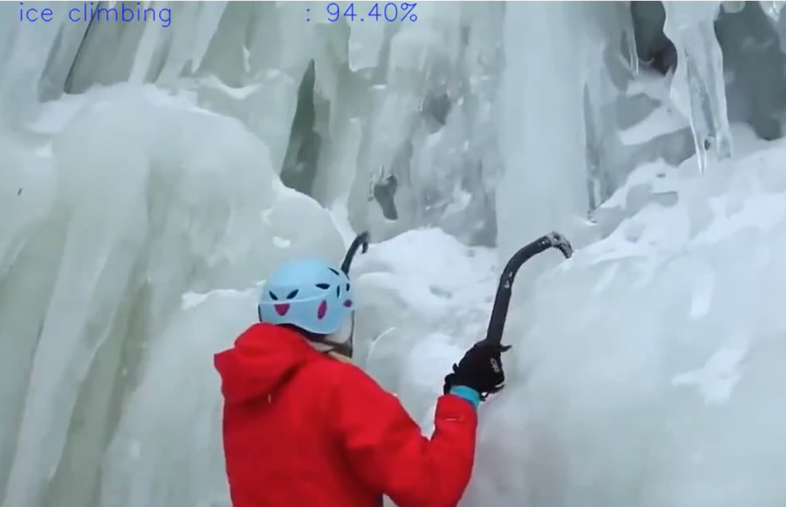

# Split Long Video To Short Videos By Using I3D Neural Network

Please install below scripts.

##### 1. `sudo apt-get install ffmpeg`

##### 2. `pip install -q "tensorflow>=1.7" "tensorflow-hub" "imageio"`

- It will divide your long video to short videos by using I3D Neural Network, which is developed by Deepmind.

All processes runned on Google Cloud machine, but you can also run in Google Colab. Please open "Split.ipynb" jupyter notebook, then run each row.

### Note: 
Please, be careful on folders name in each row, all of them runned on my cloud, you need to edit them firstly.

##### You can see example video by clicking image below

